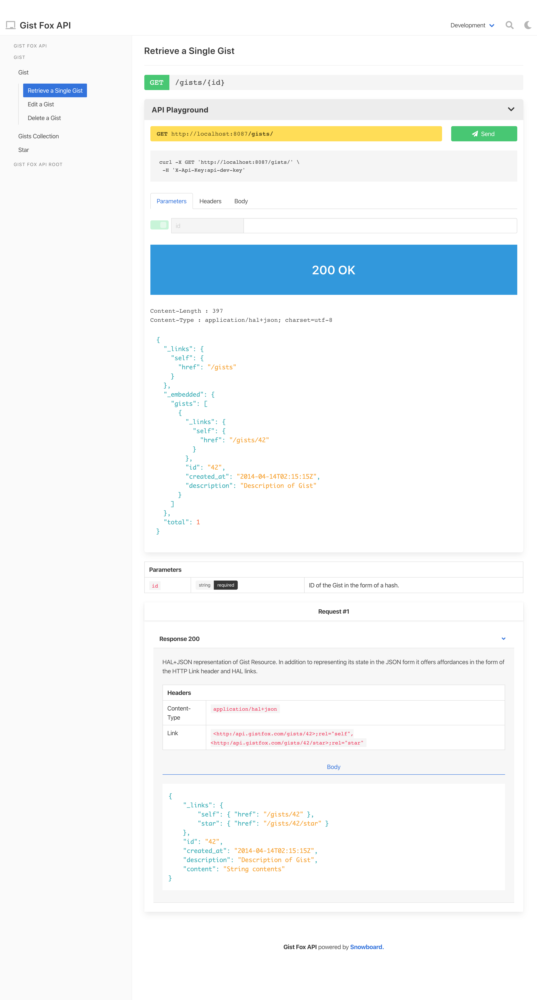

# snowboard

[](https://quay.io/repository/bukalapak/snowboard)

API blueprint toolkit.



## Packages

| NPM                                                                   | Version                                                                                                                     |
| --------------------------------------------------------------------- | --------------------------------------------------------------------------------------------------------------------------- |
| [snowboard](./packages/snowboard/README.md)                           | [](https://www.npmjs.com/package/snowboard)                           |
| [snowboard-reader](./packages/snowboard-reader/README.md)             | [](https://www.npmjs.com/package/snowboard-reader)             |
| [snowboard-parser](./packages/snowboard-parser/README.md)             | [](https://www.npmjs.com/package/snowboard-parser)             |
| [snowboard-helper](./packages/snowboard-helper/README.md)             | [](https://www.npmjs.com/package/snowboard-helper)             |
| [snowboard-linter](./packages/snowboard-linter/README.md)             | [](https://www.npmjs.com/package/snowboard-linter)             |
| [snowboard-mock-router](./packages/snowboard-mock-router/README.md)   | [](https://www.npmjs.com/package/snowboard-mock-router)   |
| [snowboard-seeder](./packages/snowboard-seeder/README.md)             | [](https://www.npmjs.com/package/snowboard-seeder)             |
| [snowboard-packer](./packages/snowboard-packer/README.md)             | [](https://www.npmjs.com/package/snowboard-packer)             |
| [snowboard-theme-helper](./packages/snowboard-theme-helper/README.md) | [](https://www.npmjs.com/package/snowboard-theme-helper) |
| [snowboard-theme-winter](./packages/snowboard-theme-winter/README.md) | [](https://www.npmjs.com/package/snowboard-theme-winter) |

### Docker

You can also use automated build docker image on `quay.io/bukalapak/snowboard`:

```
$ docker pull quay.io/bukalapak/snowboard
$ docker run -it --rm quay.io/bukalapak/snowboard help
```

To run snowboard with the current directory mounted to `/doc`:

```
$ docker run -it --rm -v $PWD:/doc quay.io/bukalapak/snowboard html -o outDir API.apib
```

## Usage

Let's say we have API Blueprint document called `API.apib`, like:

```apib
# API
## GET /message
+ Response 200 (text/plain)

        Hello World!
```

There are some scenarios we can perform, like:

```
# generate HTML documentation
$ snowboard html -o outDir API.apib

# run mock server
$ snowboard mock API.apib

# and more, see sections below
```

## HTML Documentation

To generate HTML documentation, we can do:

```
$ snowboard html -o outDir API.apib
```

Above command will generate HTML documentation in `output` directory using `snowboard` default template (called `winter`).

### HTTP Server

If you want to access HTML documentation via HTTP, you can use `http` sub-command:

```
$ snowboard http API.apib
```

With this flag, you can access HTML documentation on `localhost:8088`.

If you need to customize binding address, you can use flag `-b`.

### API Playground

You can activate the playground feature to let your users interact with your staging or even production API.

Playground requires a configuration contains supported environments and the name of the default environment. On each environment, you can set an authentication option.

Here's the example of playground configuration along with the different authentication combination supported:

```js
module.exports = {
  html: {
    playground: {
      enabled: true,
      env: "development",
      environments: {
        development: {
          url: "http://localhost:8087/",
          auth: {
            name: "apikey",
            options: {
              key: "api-dev-key",
              header: "X-Api-Key"
            }
          }
        },
        staging: {
          url: "https://staging.example.com/",
          auth: {
            name: "basic",
            options: {
              username: "admin",
              password: "secret"
            }
          }
        },
        production: {
          url: "https://api.example.com",
          auth: {
            name: "oauth2",
            options: {
              authorizeUrl: "https://accounts.example.com/oauth/authorize",
              tokenUrl: "https://accounts.example.com/oauth/access_token",
              callbackUrl: "https://www.example.com",
              clientId: "<client-id>",
              scopes: "<scope-names>"
            }
          }
        }
      }
    }
  }
};
```

Once you have a configuration file, named `snowboard.config.js`, you can do:

```
$ snowboard html -o outDir API.apib

# http sub-command works too
$ snowboard http API.apib
```

To disable playground on particular environment, you can add `playground: false` under environment configuration, like:

```js
module.exports = {
  html: {
    playground: {
      enabled: true,
      env: "development",
      environments: {
        development: {
          url: "http://localhost:8087/",
          playground: false
        },
        staging: {
          url: "https://staging.example.com/"
        }
      }
    }
  }
};
```

## Mock Server

Another snowboard useful feature is having a mock server. You can use `mock` sub-command for that.

```
$ snowboard mock API.apib
```

Then you can use `localhost:8087` for accessing mock server. You can customize the address using flag `-b`.

For multiple responses, you can set `Prefer` header to select a specific response:

```
Prefer: status=200
```

You can also supply multiple inputs for `mock` sub-command:

```
$ snowboard mock API.apib OTHER.apib
```

### Mock Server Authentication

The mock server supports various authentication, you can enable that by passing a configuration file using configuration file `snowboard.config.js`, like:

```
$ snowboard mock API.apib
```

Here's the example of the configuration file for mock server:

**API key authentication**

```js
module.exports = {
  mock: {
    auth: {
      name: "apikey",
      options: {
        key: "<api-key>",
        header: "<Header-Name>"
      }
    }
  }
};
```

**Basic authentication**

```js
module.exports = {
  mock: {
    auth: {
      name: "basic",
      options: {
        username: "<username>",
        password: "<password>"
      }
    }
  }
};
```

## Other Features

Besides the above features, snowboard also has several useful features for working with API blueprint:

### Validate API blueprint

Besides rendering to HTML, snowboard also support validates API blueprint document. You can use `lint` sub-command.

```
$ snowboard lint API.apib
```

Using flag `--json`, you will receive output as JSON format.

### Render API Element JSON

In case you need to get API element JSON output for further processing, you can use:

```
$ snowboard json API.apib
```

### List Routes

If you need to list all available routes for current API blueprints, you can do:

```
$ snowboard list API.apib ANOTHER.apib
```

Using flag `--json`, you will receive output as JSON format.

## SSL Support

To enable HTTPS server, both `http`, and `mock` subcommand supports SSL configuration. You can do:

```
# http server
$ snowboard http -S -C cert.pem -K key.pem API.apib

# mock server
$ snowboard mock -S -C cert.pem -K key.pem API.apib
```

For example, for local development, you can utilize [mkcert](https://github.com/FiloSottile/mkcert) to create your local development certificate and use it with snowboard:

```
# generate localhost certificate
$ mkcert -install
$ mkcert localhost

# use the generated certificate with snowboard http or mock subcommand
$ snowboard http -S -C localhost.pem -K localhost-key.pem API.apib

# you can now access using https://localhost:8088/
```

## Watcher Support

To enable auto-regeneration on input files updates, you can add global flag `--watch`

```
$ snowboard html --watch -o outDir API.apib

# http server
$ snowboard http --watch API.apib
```

## Help

```
$ snowboard help
API blueprint toolkit

VERSION
  snowboard/4.0.0

USAGE
  $ snowboard [COMMAND]

COMMANDS
  apib  render API blueprint
  help  display help for snowboard
  html  render HTML documentation
  http  serve HTML documentation
  json  render API elements json
  lint  validate API blueprint
  list  list API routes
  mock  run mock server
```
